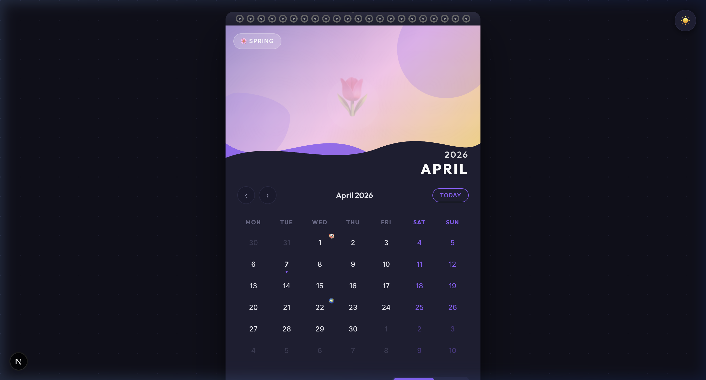

# 🗓️ Interactive Wall Calendar Component

A polished, interactive React/Next.js calendar component inspired by physical wall calendars. Built with **Next.js 16 (App Router)** and **vanilla CSS modules** — no Tailwind, no component libraries.



---

## ✨ Features

### Core Requirements
- **Wall Calendar Aesthetic**: Spiral binding, wave overlays, seasonal gradient hero, paper shadow
- **Day Range Selector**: Click two dates to select a range with clear visual states for start, end, and in-between days
- **Integrated Notes Section**: Monthly notes and range-specific notes with ruled-line aesthetic, persisted via `localStorage`
- **Fully Responsive Design**: Adapts flawlessly from desktop (centered paper) to mobile (stacked, touch-friendly)

### Creative Extras
| Feature | Description |
|---|---|
| 🎨 **Seasonal Themes** | Each month gets a unique gradient hero and accent color palette |
| 🌗 **Dark/Light Mode** | Toggle with smooth transitions; preference persisted |
| 📌 **Holiday Markers** | Emoji dots on holidays with tooltip on hover |
| 🔄 **Page Flip Animation** | CSS 3D perspective animation when switching months |
| 📱 **Touch Gestures** | Swipe left/right to change months on mobile |
| ⌨️ **Keyboard Navigation** | Arrow keys to navigate months |
| 💾 **Persistence** | Notes and theme preference survive page refresh |
| 🖨️ **Print-Friendly** | `@media print` stylesheet for clean printout |

---

## 🏗️ Architecture

```
src/
├── app/
│   ├── layout.js          # Root layout, fonts, SEO meta
│   ├── page.js            # Main page (dynamic imports, SSR-safe)
│   └── globals.css        # Design system: tokens, themes, animations
├── components/
│   ├── Calendar/
│   │   ├── Calendar.jsx           # Orchestrator (state, gestures, keyboard)
│   │   ├── CalendarHero.jsx       # Gradient hero + month overlay
│   │   ├── CalendarGrid.jsx       # 7-column date grid with range selection
│   │   ├── NotesPanel.jsx         # Monthly + range notes with ruled lines
│   │   ├── MonthNav.jsx           # ‹ › Today navigation
│   │   ├── SpiralBinding.jsx      # Decorative spiral rings + wall hook
│   │   └── *.module.css           # Scoped styles for each component
│   └── ThemeSwitcher/
│       ├── ThemeSwitcher.jsx      # Dark/Light toggle
│       └── ThemeSwitcher.module.css
├── hooks/
│   ├── useCalendar.js     # Month navigation state + direction tracking
│   ├── useRangeSelect.js  # Two-click range selection logic
│   └── useNotes.js        # Notes CRUD + localStorage persistence
├── utils/
│   ├── dateHelpers.js     # Grid generation, date comparisons, formatters
│   └── holidays.js        # Static holiday data with emoji markers
└── data/
    └── monthThemes.js     # 12 gradient themes + accent color palettes
```

### Design Decisions

- **Vanilla CSS Modules**: Maximum control over styling with zero runtime cost. Each component is fully scoped.
- **No external dependencies**: Only `next`, `react`, and `react-dom`. Everything is custom-built.
- **Dynamic imports with `ssr: false`**: Calendar uses `localStorage`, so we avoid hydration mismatches.
- **CSS Custom Properties**: All colors, spacing, and shadows defined as tokens for easy theming.
- **Gradient hero instead of images**: Pure CSS gradients with floating shapes ensure instant load and consistent appearance.

---

## 🚀 Getting Started

### Prerequisites
- Node.js 18+ and npm 9+

### Installation

```bash
# Clone the repository
git clone <repo-url>
cd take_u_forward_intern

# Install dependencies
npm install

# Start development server
npm run dev
```

Open [http://localhost:3000](http://localhost:3000) in your browser.

### Production Build

```bash
npm run build
npm start
```

### Deploy to Vercel

```bash
npx vercel
```

---

## 🎮 How to Use

1. **Navigate months**: Click ‹ › buttons, press ← → arrow keys, or swipe on mobile
2. **Select a date range**: Click a start date, then click an end date — the range highlights automatically
3. **Clear selection**: Click the "Clear" button in the selection info bar
4. **Add notes**: Use the "Monthly" tab for general notes, or select a range and switch to "Range" for range-specific notes
5. **Toggle theme**: Click the 🌙/☀️ button in the top-right corner
6. **Hover holidays**: Hover over emoji markers to see holiday names

---

## 📱 Responsive Breakpoints

| Breakpoint | Layout |
|---|---|
| `> 768px` | Desktop — centered 520px max-width paper card |
| `480–768px` | Tablet — full-width, slightly reduced hero |
| `< 480px` | Mobile — compact hero, touch-optimized grid, swipe hint |

---

## 🧪 Tech Stack

- **Framework**: Next.js 16.2 (App Router)
- **Language**: JavaScript (ES2022)
- **Styling**: Vanilla CSS Modules
- **State Management**: React hooks (`useState`, `useCallback`, `useMemo`, `useEffect`)
- **Persistence**: `localStorage`
- **Fonts**: Outfit + Inter (Google Fonts)

---

## 📄 License

MIT
